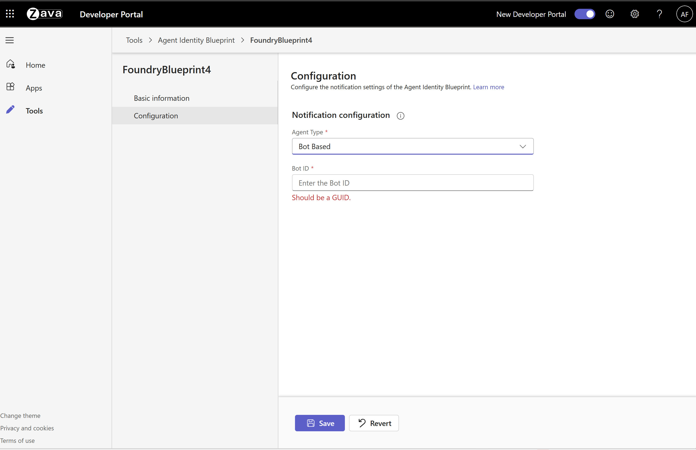

# 🤖 Workstream Manager Autopilot Agent

> A Foundry A365 agent that lives in Teams group chats and DMs, tracks the work your team is doing, and answers questions about the workstream — grounded in the chat's conversation history plus any other sources you give it access to (SharePoint, specs, Azure DevOps, etc.).

---

## ✨ What it does

The Workstream Manager is a Foundry Autopilot agent designed to live in Teams group chats. Out of the box, the sample ships with a few concrete responsibilities you can extend:

- **Manager onboarding flow** — The first time the manager DMs the agent, it introduces itself and walks them through setup: how to grant access to others, how it tracks work items, and how to pull a summary. To revisit setup or see the options again, managers can run `/onboarding`.
- **Manager-controlled access** — By default only the agent's manager can talk to it. The manager can extend access to others with `/access add <upn>`, `/access remove <upn>`, and `/access list`. In group chats every participant must be approved, and the agent only chimes in when actually addressed — so it stays quiet during side conversations.
- **Tracks open items** — Captures every commitment that requires follow-up — any time someone agrees to look into something and report back. These are often small, easily-forgotten items like *"Amanda will file a bug for that,"* or *"can you revise the wording on this Figma screen?"* The agent reacts to the message it captured with a 📌 emoji, even when the commitment surfaces in a side conversation it wasn't directly part of. Owner, description, status, and ETA persist between sessions, so you can ask later who's on what and the agent remembers.
- **On-demand workstream summary** — Run `/workstreamsummary run` and the agent posts a digest of every open work item grouped by owner. A natural starting point if you want to graduate it into a recurring daily or weekly digest.
- **Workstream Q&A** — Answers questions about the workstream using prior conversation history plus any additional sources you grant it access to, like your team's SharePoint site, specs, or Azure DevOps.
- **Built-in WorkIQ tools** — Comes pre-wired with Microsoft 365 tools so the agent can act on the things your team actually works in: Word docs, Excel sheets, Outlook mail, calendar, and OneDrive/SharePoint files. Ask it to draft an email, summarize a spec, or pull last week's meeting notes and it goes straight to the source — no extra configuration.
- **Knows when to chime in (and when to stay quiet)** — In a 1:1 DM every message is for the agent, so it replies. In group chats it only responds when actually addressed: an explicit @mention, or — for natural replies like *"thanks, can you also..."* — a quick check on whether the message is directed at the agent given the conversation so far. Side conversations between humans are left alone.
- **Reacts to messages it sees** — The agent uses emoji reactions so it's clear what it noticed. Messages it's going to reply to get a 👍. Messages it captures as a work item get a 📌 — so you can scan the chat and see at a glance what's being tracked, whether the agent replied in the thread or not.

A single Workstream Manager agent keeps track of what everyone is working on, so anyone on the team can stay current on progress without interrupting others for routine questions — they can just DM the autopilot.

---

## 📋 Prerequisites

**Note:** You must be enrolled in the [Frontier preview program](https://adoption.microsoft.com/en-us/copilot/frontier-program/) to publish a Foundry agent to Microsoft Agent 365.

Ensure you have the following installed:

| Requirement | Description |
|------------|-------------|
| [Azure Developer CLI](https://learn.microsoft.com/azure/developer/azure-developer-cli/install-azd) | Infrastructure deployment tool |
| [.NET 9.0 SDK](https://dotnet.microsoft.com/download) | Development framework |


### 🔐 Required Permissions

- **Owner** role on the Azure subscription
- **Azure AI User** or **Cognitive Services User** role at subscription or resource group level
- **Tenant Admin** role for organization-wide configuration

---

## 🚀 Quick Start

### Step 1: Authenticate

Login to your Azure tenant and authenticate with Azure Developer CLI:

Based on tenant security settings, sometimes just az login might be sufficient, sometimes one will need to login to each scope that is used in these scripts.

```powershell
# Login to Azure CLI
az login

az login --scope https://ai.azure.com/.default

az login --scope https://graph.microsoft.com//.default

az login --scope https://management.azure.com/.default
# Login to Azure Developer CLI
azd auth login
```

### Step 2: Deploy Everything

> **Tip:** Before deploying you can customize the agent's instructions, tools, and access behavior — see [**🛠️ Customize the sample**](#-customize-the-sample) below.

#### Deploy

Ensure Docker is running, then execute:

```powershell
azd provision
```

After deployment completes, retrieve your resource values:

```powershell
azd env get-values
```

> **📌 What to expect after deployment:**  
> After `azd provision` completes successfully, you will see a pending agent request in the Microsoft 365 admin center. First publish that request, then configure the blueprint in Teams Developer Portal, and finally create agent instances from that blueprint.

### Step 3: Review and Publish the Agent Request

**Important:** In the current UI, this appears as a pending **agent request**. Publish this request first. Agent instances are created later in Step 5.

1. Navigate to the [Microsoft 365 admin center](https://admin.cloud.microsoft/?#/agents/all/requested)
2. Under **Requests**, locate your pending agent request:
   

3. Open the request and click **Publish to store**:
   

### Step 4: Configure Teams Integration

After approving the agent blueprint, configure it in the Teams Developer Portal:

1. Open the [Teams Developer Portal](https://dev.teams.microsoft.com/tools/agent-blueprint) and locate your approved agent blueprint
    
   **Note:** Only 100 Agent Blueprints are displayed. If yours isn't visible, click any blueprint to open its details page, then in the browser's address bar replace the blueprint ID portion of the URL with your own Blueprint ID from the previous step (for example: `https://dev.teams.microsoft.com/tools/agent-blueprint/<your-blueprint-id>`).
   

2. Get your Blueprint ID:
   ```powershell
   azd env get-values
   ```

3. Navigate to **Configuration** and add your **Bot ID** (same as Blueprint ID):
   

### Step 5: Create Agent Instances

After configuring the agent blueprint in Teams Developer Portal, you can now create agent instances based on your blueprint:

1. In Microsoft Teams, navigate to **Apps** → **Agents for your team**
2. Find the agent named by your `AGENT_NAME` value and create an instance:
   ```powershell
   azd env get-value AGENT_NAME
   ```
   

---

## 🛠️ Customize the sample

Every behavior described in [**What it does**](#-what-it-does) is intentionally small and editable. Here's where to look for each common change.

### Agent persona, tone, and instructions

Edit [`AgentLogic/AgentInstructions.cs`](./src/workstream_manager_agent/AgentLogic/AgentInstructions.cs). This is the system prompt the LLM uses every turn. Sections worth customizing:

- The opening identity (`You are a helpful agent named ...`)
- The **Onboarding** section (what to ask when first DM'd by the manager)
- The **Work Item Tracker** section (rules for when to call `create_work_item`, what fields to collect, ISO 8601 ETA conversion)
- The **Silent capture on work-item-only turns** section (when to reply with text vs. just react with 📌)
- The **General** style/formatting rules

### Add or remove tools (Microsoft 365 surfaces, external MCP servers)

Edit [`ToolingManifest.json`](./src/workstream_manager_agent/ToolingManifest.json). Each entry is an MCP server exposed to the agent. The defaults wire up Word, Excel, Outlook Mail, Calendar, and OneDrive/SharePoint — remove what you don't want, add new ones for your own MCP servers (e.g. an Azure DevOps MCP, GitHub MCP, or a custom internal data source). See [MCP tooling docs](https://learn.microsoft.com/en-us/microsoft-agent-365/tooling-servers-overview) for the schema.

For each MCP server you add, also add the scope to the OAuth2 grants in [`scripts/create-blueprintsp-oauth2-grants.ps1`](./scripts/create-blueprintsp-oauth2-grants.ps1) so the blueprint SP has consent to call it.

### Model deployment

By default the agent uses `gpt-5-chat`. To switch:

1. Update `ModelDeployment` in [`appsettings.json`](./src/workstream_manager_agent/appsettings.json).
2. Update `modelName` / `modelVersion` in [`infra/main.bicep`](./infra/main.bicep) so `azd provision` creates the matching deployment.

### How the agent decides to respond

The "is this message for me?" logic lives in [`AgentLogic/ResponsesApi/Helpers/AddressedToAgentGate.cs`](./src/workstream_manager_agent/AgentLogic/ResponsesApi/Helpers/AddressedToAgentGate.cs). It runs three deterministic short-circuits (explicit @mention by id, parsed `<at>` matching the bot's name/alias, 1:1 personal chat) and falls back to a small LLM judge for ambiguous group-chat cases like *"thanks, can you also..."*.

Two knobs:

- **`AgentDisplayNameAliases`** in [`appsettings.json`](./src/workstream_manager_agent/appsettings.json) — comma- or semicolon-separated names users actually `@`-mention the bot with in chats. Used as a deterministic fallback when the bot's per-chat display name can't be resolved from Microsoft Graph.
- **The LLM judge prompt** — edit `judgeInstructions` / `judgeInput` in `AddressedToAgentGate.IsAddressedToAgentAsync` to tighten or loosen what counts as "addressed to the agent."

### Access control (manager-only DMs, allowlist, group chat gating)

Lives in [`AgentLogic/ResponsesApi/Helpers/AccessControlService.cs`](./src/workstream_manager_agent/AgentLogic/ResponsesApi/Helpers/AccessControlService.cs). Three configurable canned responses in [`appsettings.json`](./src/workstream_manager_agent/appsettings.json):

- **`DirectMessageManagerContact`** — the label the agent uses for the manager in canned responses (defaults to display name from Graph).
- **`GroupChatUnauthorizedResponse`** — what the agent says in group chats when not everyone is approved. Supports `{Manager}`, `{UnauthorizedCount}`, `{UnauthorizedParticipants}` placeholders.
- **`CrossTenantUnauthorizedResponse`** — what the agent says when contacted from outside the digital worker's tenant.

`azd provision` automatically creates Azure Table Storage to persist the allowlist between sessions (default table: `digitalworkerallowlist`).

### Work item tracking (what gets captured, where it's stored)

- **Tool definitions and schema** — [`AgentLogic/ResponsesApi/Helpers/WorkItemToolHandler.cs`](./src/workstream_manager_agent/AgentLogic/ResponsesApi/Helpers/WorkItemToolHandler.cs). Edit the `GetToolDefinitions()` JSON to add fields (e.g. priority, link to a doc, source PR url) or restrict which tools the LLM gets.
- **Storage / persistence** — [`Services/WorkItemService.cs`](./src/workstream_manager_agent/Services/WorkItemService.cs) handles read/write to Azure Table Storage. Swap the backing store here if you want Cosmos DB, Dataverse, Azure DevOps work items, etc.
- **Passive detection in side conversations** — [`AgentLogic/ResponsesApi/ResponsesApiAgentLogicService.cs`](./src/workstream_manager_agent/AgentLogic/ResponsesApi/ResponsesApiAgentLogicService.cs) → `TryPassiveWorkItemDetectionAsync`. Edit the instructions inside that method to tune what counts as a "trackable commitment" (and what to ignore — hypotheticals, past tense, etc.).

### Reactions (👍 and 📌)

[`AgentLogic/ResponsesApi/Helpers/ReactionService.cs`](./src/workstream_manager_agent/AgentLogic/ResponsesApi/Helpers/ReactionService.cs) owns the Graph `setReaction` call. Change the emojis by editing the codepoints passed to `SetReactionAsync` in [`ResponsesApiAgentLogicService.cs`](./src/workstream_manager_agent/AgentLogic/ResponsesApi/ResponsesApiAgentLogicService.cs) (👍 on text replies) and [`WorkItemToolHandler.cs`](./src/workstream_manager_agent/AgentLogic/ResponsesApi/Helpers/WorkItemToolHandler.cs) (📌 on work-item capture). To disable a reaction entirely, comment out the corresponding `SetReactionAsync` call.

### Workstream summary

The `/workstreamsummary run` command is handled in [`WorkItemToolHandler.TryHandleSummaryCommandAsync`](./src/workstream_manager_agent/AgentLogic/ResponsesApi/Helpers/WorkItemToolHandler.cs). Edit the grouping, formatting, or filter logic there. To make it recurring instead of on-demand, point an Azure Function timer trigger at the same code path.

### Infrastructure (Azure resources)

[`infra/main.bicep`](./infra/main.bicep) declares everything `azd provision` creates: the Cognitive Services account + project, ACR, bot service, blueprint, and the two storage accounts (DM allowlist + work items). Edit the parameters at the top of `main.bicep` to change SKUs, region, or naming.

---

## 🏗️ Architecture Overview

This deployment orchestrates six key components to create a fully functional A365 agent:

### 1️⃣ Creating a Foundry Project

Creates a Foundry project configured to support hosted agents with appropriate permissions on an Azure Container Registry for building and storing Docker images.

📚 [Learn more about prerequisites](https://github.com/microsoft/container_agents_docs?tab=readme-ov-file#11---prerequisites)

### 2️⃣ Creating an Application

Applications provide stable endpoints and identity for exposing your agent to users while maintaining development flexibility within Foundry. The application is configured to accept requests from Azure Bot Service.

### 3️⃣ Setting up Azure Bot Service

Azure Bot Service acts as a relay between M365 ecosystem interactions and the Foundry application. The bot is configured with:

- Application endpoint
- Application's agent blueprint identity as the appId

### 4️⃣ Building a Hosted Agent

Compiles the sample code into a Docker container and registers it as a hosted agent with the Foundry project.

📚 [Learn more about building agents](https://github.com/microsoft/container_agents_docs?tab=readme-ov-file#14---build-agent-image)

### 5️⃣ Deploying the Agent

Deploys the hosted agent to the application, granting it:

- Access to the application's identity
- Configuration to serve application requests

📚 [Learn more about agent deployment](https://github.com/microsoft/container_agents_docs?tab=readme-ov-file#step-2-deploy-agent)

### 6️⃣ Publishing to Your Organization

Publishes the application to Microsoft 365 via Foundry API, creating a hireable digital worker with:

- Digital worker metadata
- Agent blueprint ID
- Digital worker designation

> **⚠️ Important**: The agent requires [admin approval](https://learn.microsoft.com/en-us/entra/identity/enterprise-apps/review-admin-consent-requests#review-and-take-action-on-admin-consent-requests-1) before becoming available for hiring.

---

## 📖 Additional Resources

- [Foundry Container Agents Documentation](https://github.com/microsoft/container_agents_docs)
- [Azure Developer CLI Documentation](https://learn.microsoft.com/azure/developer/azure-developer-cli/)
- [Agent Blueprint Configuration](https://dev.teams.microsoft.com/tools/agent-blueprint)

---

## 🤝 Support

For issues or questions, please refer to the official documentation or contact your Azure administrator.

